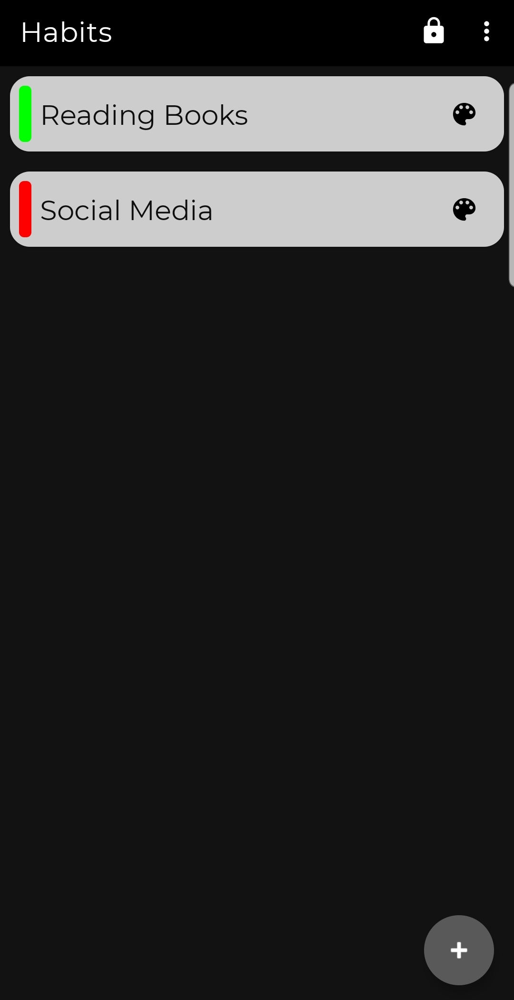
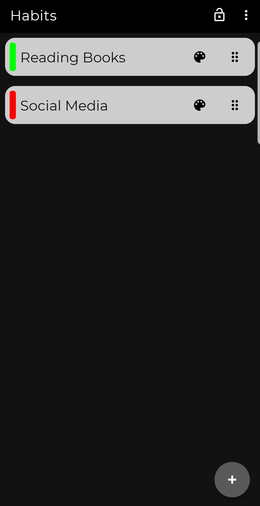
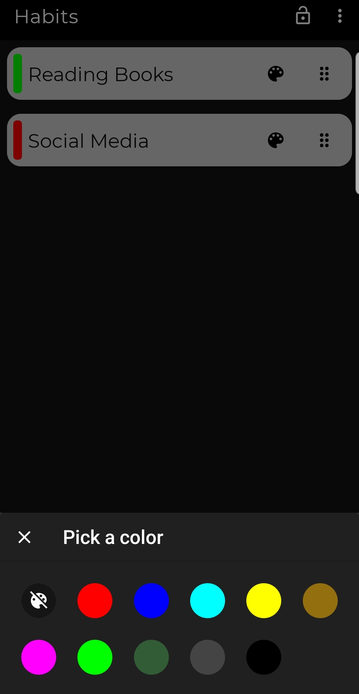
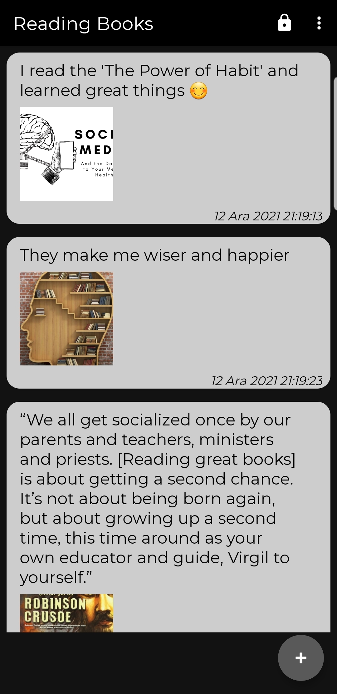
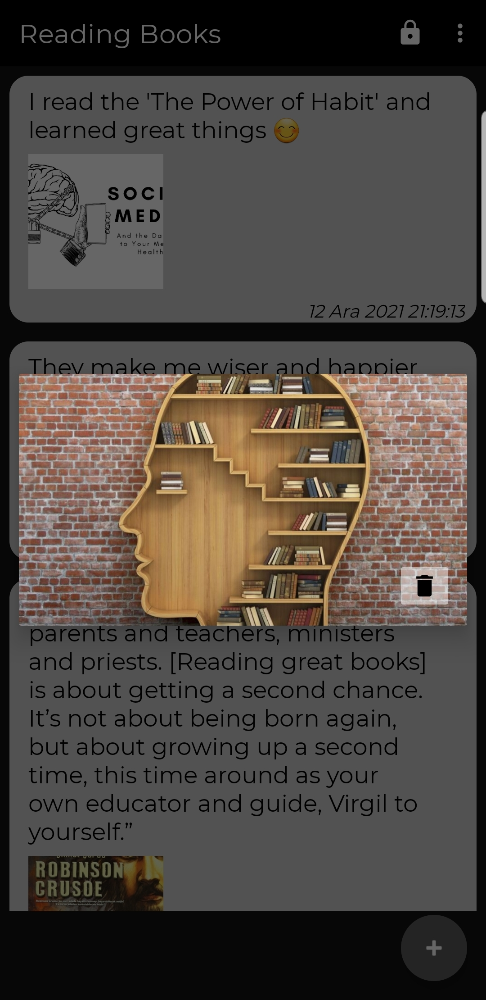

# Habit Journal

This is an example Kotlin Android application that can be used to save experiences about habits.

It showcases some android app features like recyclerview, swipe menu, drag-drop, filtering & room
database.

## Screenshots

<table>
  <table>
  <tr>
    <td>Main</td>
    <td>Drag View</td>
    <td>Tagging</td>
  </tr>
  <tr>
    <td></td>
    <td></td>
    <td></td>
  </tr>
  <tr>
    <td>Experiences</td>
    <td>Image Attachment</td>
  </tr>
  <tr>
    <td></td>
    <td></td>
  </tr>
</table>

## App Links

